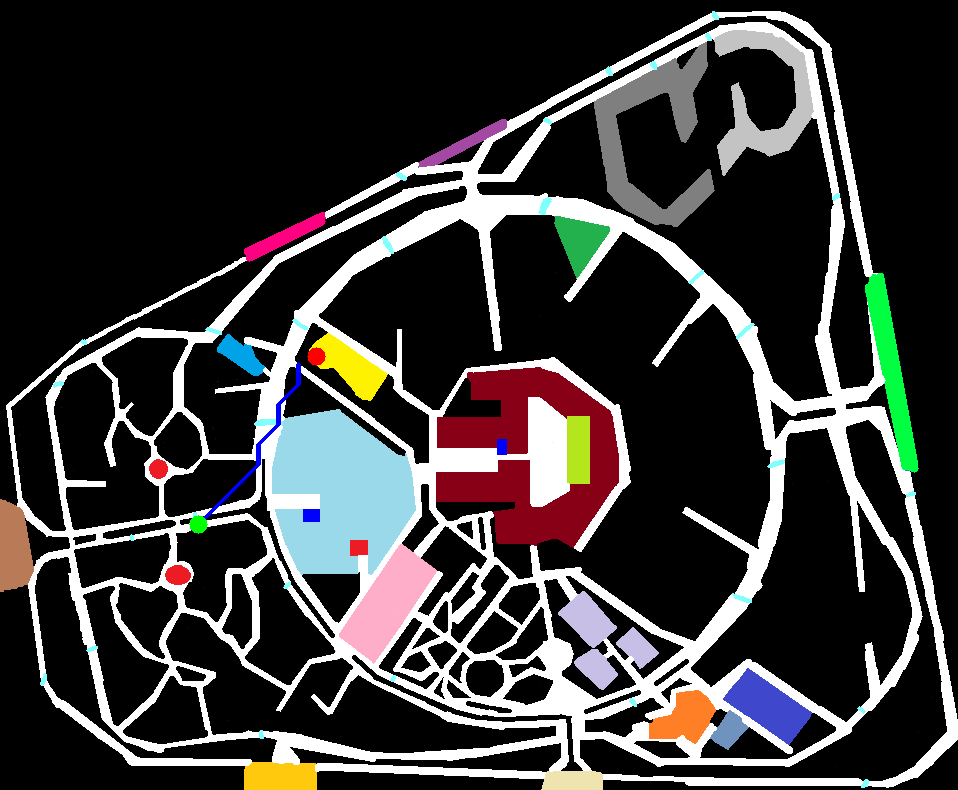
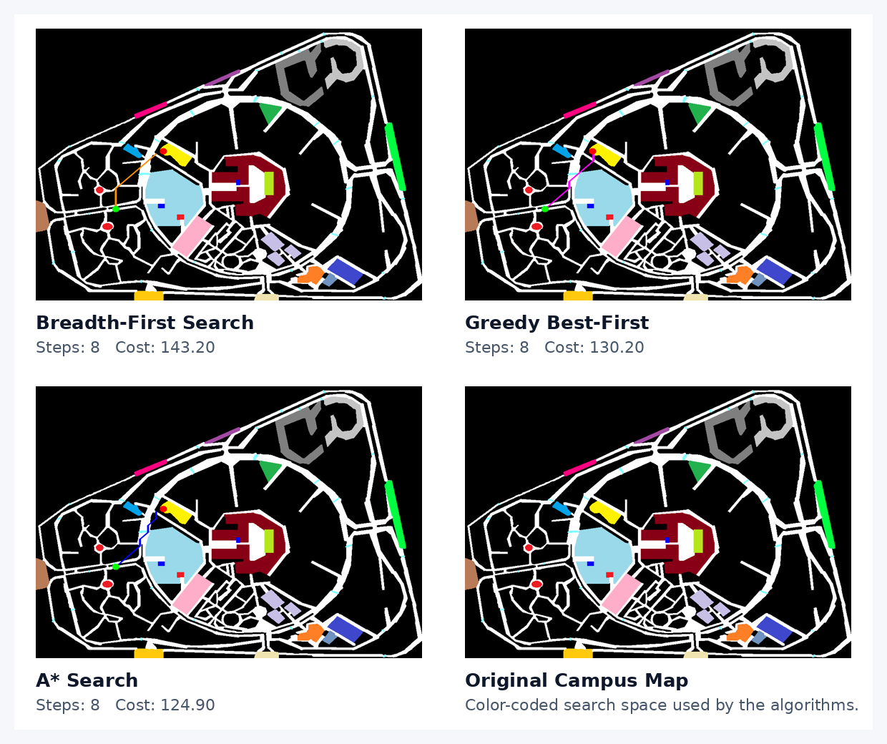
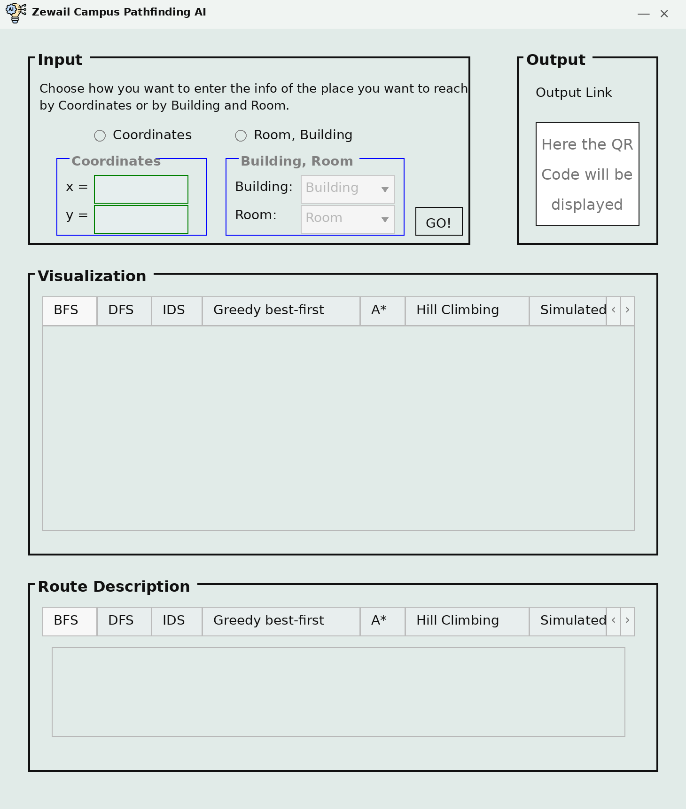
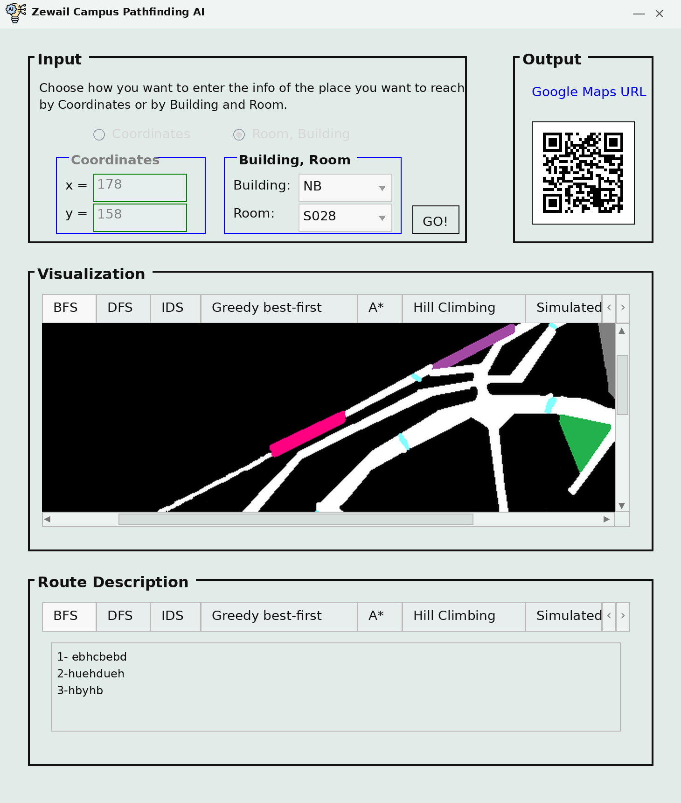
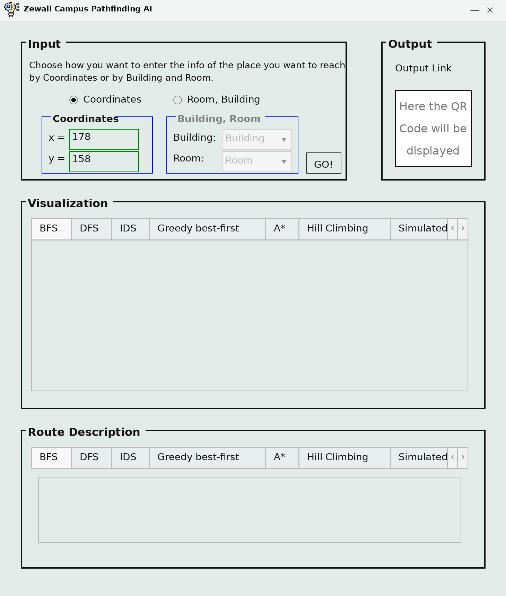
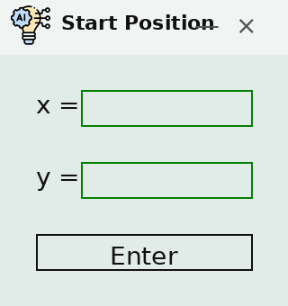

# Zewail City Campus Pathfinding AI

A python project for an AI course that models the Zewail City campus as a weighted search problem and finds routes between campus locations using classic AI search algorithms.

This project features a color coded campus map, room/building lookup in spreadsheet, PyQt5 desktop interface and a number of search algorithms such as A* search, breadth-first search, greedy best-first search, hill climbing and simulated annealing.

## Preview

### Campus Map


### A* Route Example



### Algorithm Route Comparison



## GUI Preview

<table>
  <tr>
    <td align="center" width="50%">
      
      <br />
      <strong>Main Window Layout</strong>
    </td>
    <td align="center" width="50%">
      
      <br />
      <strong>Route Output Workflow</strong>
    </td>
  </tr>
  <tr>
    <td align="center" width="50%">
      
      <br />
      <strong>Coordinate Entry Mode</strong>
    </td>
    <td align="center" width="50%">
      
      <br />
      <strong>Start Position Dialog</strong>
    </td>
  </tr>
</table>

## Project Overview

The campus picture is viewed as a search grid by the application. Each pixel color represents a semantic region, e.g. road, building, blocked area, landmark, etc. The route planner evaluates movement over this grid using weighted traversal costs and a goal-directed heuristic.

The desktop GUI has two workflows for destination entry:

* Provide a target (x, y) position to coordinate routing.
* Room/Building based routing by lookup sheet in `Rooms.xlsx`.

The project also contains non-GUI scripts that directly output routes from the algorithm code, allowing for easier review of the visual results without having to start the full interface.

## Features

- Color-coded campus map used as the search space.
- Weighted movement costs based on map region color.
- Coordinate-based and room/building-based destination selection.
- Desktop interface with input, output, visualization, and route-description panels.
- Multiple search algorithms.

## Search Algorithms

The project includes implementations of:

- Breadth-first tree search
- Breadth-first graph search
- Depth-first search
- Iterative deepening search
- Greedy best-first search
- A* search
- Hill climbing
- Simulated annealing

## How the Search Space Works

The map processing pipeline takes `image.png` as input, rescales it and normalizes the colors that represent campus areas. Then the search problem is defined by:

- an initial state;
- a goal state;
- valid movement actions;
- a result function;
- a goal test;
- a step-cost function;
- and a heuristic function.

Movement is possible in eight directions. Each step of the movement has a cost depending on the color of the region crossed by the path.

## How to Run

### 1. Install dependencies

```bash
pip install PyQt5 xlwings opencv-python numpy matplotlib Pillow
```

### 2. Generate the sample A* route (optional)

```bash
python generate_sample_route.py
```

This creates:

```text
sample_astar_route.png
```

### 3. Run the GUI application

```bash
python AI_Project1.py
```

## Summary

This project is to show how a real map like image can be converted to an AI search problem. It links classical search algorithms with a practical campus routing interface.
